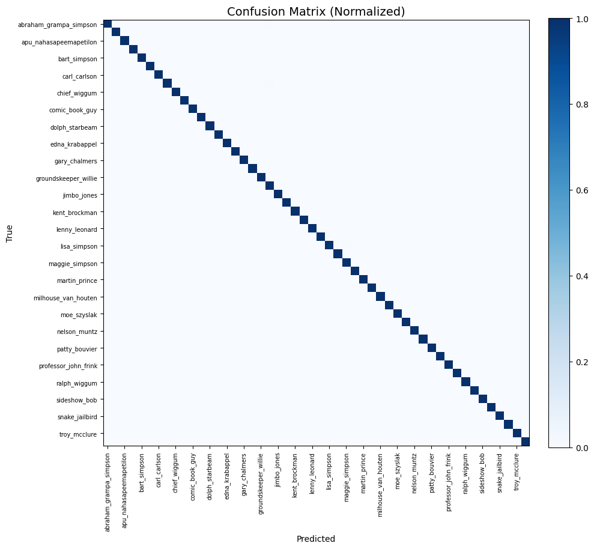
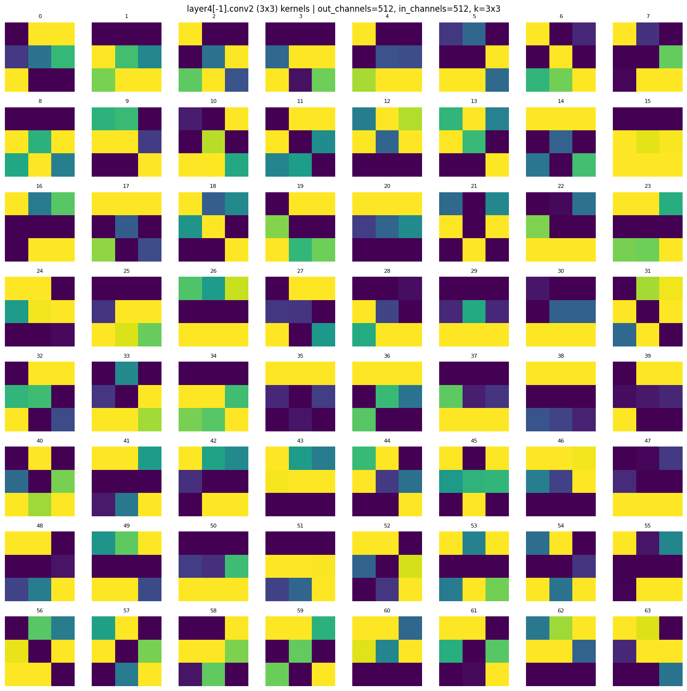
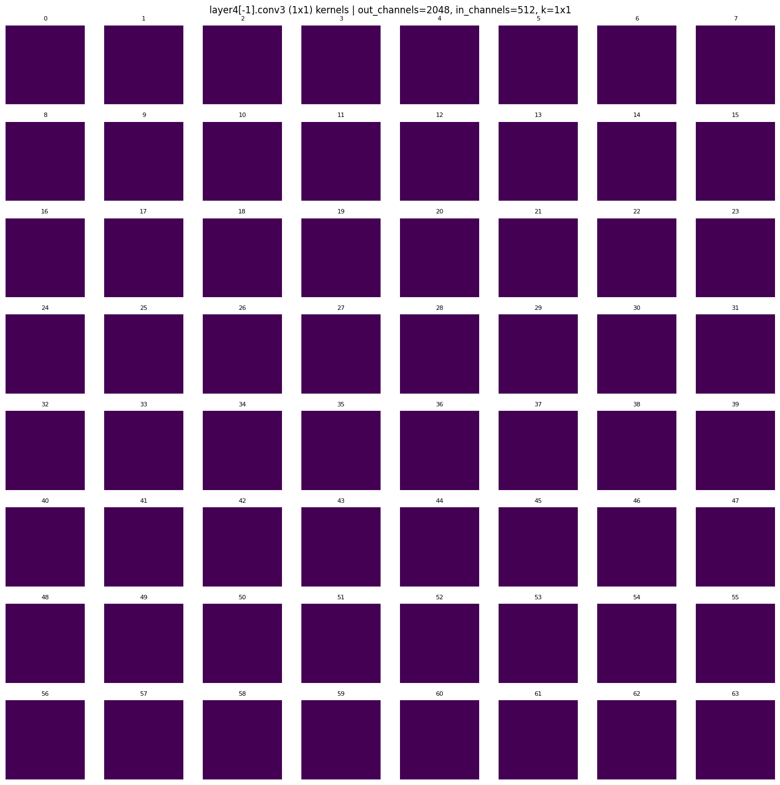
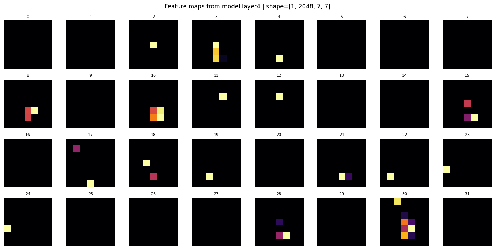
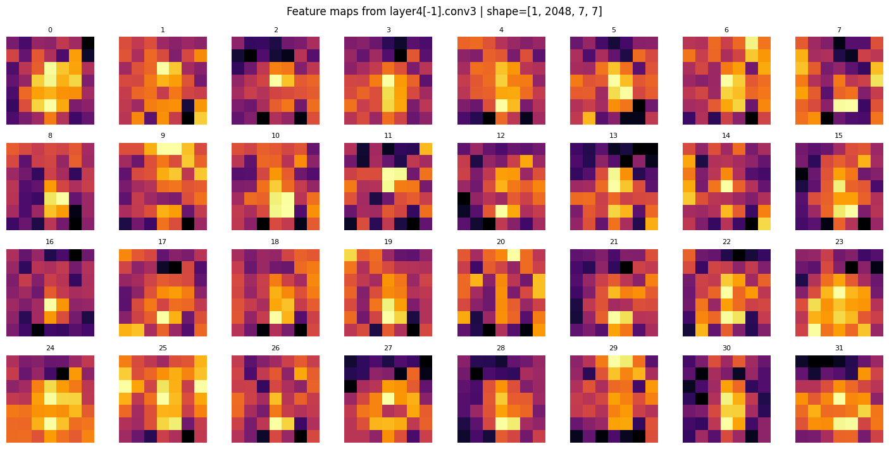

# Simpsons Character Classification Project Report

## I. Experimental Objective
This project aims to build a deep learning model capable of automatically identifying 50 characters from *The Simpsons* TV show.  
By leveraging the ResNet101 pre-trained model along with various data augmentation and regularization techniques, the model's classification accuracy under diverse facial expressions and background conditions is significantly improved.  
The final model achieves **91% top-1 accuracy** on the validation set, demonstrating the effectiveness of the applied strategies.

---

## II. Dataset and Preprocessing

### (1) Dataset Source
- Dataset: *The Simpsons* character images (approx. **97,000 images** in total)
- Number of Classes: **50 characters**
- Training/Validation Split: **70%/30%**
- The class distribution is approximately balanced.

### (2) Data Augmentation Strategy
| Type | Technique | Description |
|------|-----------|-------------|
| Geometric Transformations | RandomResizedCrop, Rotation, Perspective, ElasticTransform | Simulate different angles and scales |
| Color Augmentations | ColorJitter, Grayscale, Invert, Solarize | Simulate different lighting and color environments |
| Background Mixing | BackgroundMixing (p=0.35) | Mix character with random background to reduce background bias |
| Noise Handling | GaussianBlur, RandomErasing | Simulate noise and occlusion |
| Combination Techniques | MixUp, CutMix | Combine sample features and labels |
| Proportions | Weak Augmentation 30%, Strong Augmentation 70% |

This strategy significantly improves the model's robustness to **varied backgrounds and facial expressions**.

---

## III. Model Architecture and Training Configuration

| Item | Setting |
|------|---------|
| Model Architecture | ResNet101 (Pre-trained on ImageNet) |
| Optimizer | AdamW |
| Loss Function | CrossEntropyLoss (Label Smoothing = 0.03) |
| Batch Size | 16 |
| Initial Learning Rate | 0.0002 |
| Weight Decay | 0.0003 |
| Epochs | 25 |
| Learning Rate Strategy | ReduceLROnPlateau |
| Learning Rate Adjustment | FC layers ×1.0, other layers ×0.1 |
| Freezing Strategy | Initially freeze all layers, only train `fc`; Unfreeze `layer4` at epoch 5 |
| Stability Mechanism | EMA (Exponential Moving Average) |

---

## IV. Training Process
1. Initialize the ResNet101 model and load ImageNet weights.  
2. Freeze all convolutional layers and train only the fully connected (`fc`) layers.  
3. Unfreeze `layer4` at epoch 5 to fine-tune higher-level semantic features.  
4. Apply **differentiated learning rates**:  
 - Higher learning rate for `fc` layers to adapt to the new task.  
 - Lower learning rate for other layers to retain ImageNet features.  
5. Use **MixUp** and **CutMix** to enhance sample diversity.  
6. Monitor accuracy and loss after each epoch using the validation set and save the best weights.

---

## V. Experimental Results

### (1) Validation Performance
| Metric | Value |
|--------|-------|
| Top-1 Accuracy | **0.91** |
| Loss | 0.25 |
| Confusion Matrix Size | 50 × 50 |

The model performs consistently across most characters, with minor misclassifications involving visually similar characters:
- `bart_simpson` ↔ `lisa_simpson`
- `homer_simpson` ↔ `abraham_grampa_simpson`
- `nelson_muntz` ↔ `barney_gumble`

---

### (2) Confusion Matrix
The confusion matrix for the model’s predictions on the validation set:

---

### (3) Visualization and Understanding Convolutional Neural Networks
- Successfully visualized the **3x3** and **1x1 convolution kernels** from the final convolutional layer, which helps understand how the model extracts features.
  
- Below are the feature maps, which show how the model activates for different regions of the face.

#### (a) 3x3 Filter Weights (Convolution Kernels)
  
This image shows the 3x3 filters from the final convolutional layer (conv2) of the ResNet model. These filters represent how the model learns to detect local features in the input image, such as edges and color changes.

#### (b) 1x1 Filter Weights (Convolution Kernels)
  
This image shows the 1x1 filters from the final convolutional layer. These filters are typically used for channel-wise semantic mixing, and although their spatial structure is less intuitive than 3x3 filters, they play a crucial role in feature extraction and channel aggregation.

#### (c) Feature Map from the Last Layer
  
This image shows the feature map after the final convolutional layer. Each feature map reflects the model’s activation for certain regions of the image, which may correspond to key features (such as facial parts).

#### (d) Another Feature Map from the Same Layer
  
This image shows another feature map extracted from the same convolutional layer. Similar to the previous one, it visualizes how the model responds to different areas of the image.

---

## VI. Performance Comparison and Analysis

| Model Version | Accuracy | Key Improvements |
|---------------|----------|------------------|
| baseline (final.ipynb) | 0.76 | No BackgroundMixing, MixUp |
| improved (0.91_test.ipynb) | **0.91** | Added BackgroundMixing, MixUp/CutMix, Label Smoothing, EMA, Differentiated LR |

**Key Reasons for Improvement:**
1. **Background Mixing** reduces background interference, allowing the model to focus more on the character features.  
2. **Differentiated Learning Rates** allow the higher layers to quickly learn the new task, while preserving the general features from ImageNet in the lower layers.  
3. **Label Smoothing** reduces model overconfidence on single classes, improving generalization.  
4. **Strong Augmentation (70%)** increases sample diversity, enhancing the model's robustness.  
5. **EMA** improves the stability and performance of the model during training.

---

## VII. Conclusion and Observations
- The model performs well in recognizing **The Simpsons** characters, achieving high accuracy even under diverse backgrounds and lighting conditions.  
- The enhanced data augmentation strategies significantly improve the model's generalization capability.  
- The differentiated learning rates and label smoothing prevent overfitting and ensure efficient training.  
- The overall accuracy improved from **0.76** (baseline) to **0.91**, indicating the significant impact of the applied strategies.

---

## VIII. Future Directions
1. Implement **Grad-CAM** or other explainability techniques to visualize the regions the model focuses on.
2. Explore **semi-supervised learning** to handle unknown characters.  
3. Extend the model’s application to **multi-character detection** or **scene classification** in animated series.  
4. Further optimize the **Background Mixing** strategy to reduce semantic misalignment.

---

## IX. Final Performance

> 🎯 **Validation Accuracy:** **91%**  
> 🚀 **Loss:** **0.25**  
> 📈 **Model:** ResNet101 + MixUp + CutMix + LabelSmoothing + BackgroundMixing  

---

## X. Development Environment and Versions

| Package | Version |
|---------|---------|
| Python | 3.10 |
| torch | 2.1.2 |
| torchvision | 0.16.2 |
| numpy | 1.26.4 |
| pandas | 2.2.1 |
| scikit-learn | 1.5.1 |
| matplotlib | 3.8.4 |
| Pillow | 10.2.0 |
| tqdm | 4.66.2 |
| opencv-python | 4.9.0.80 |

---
